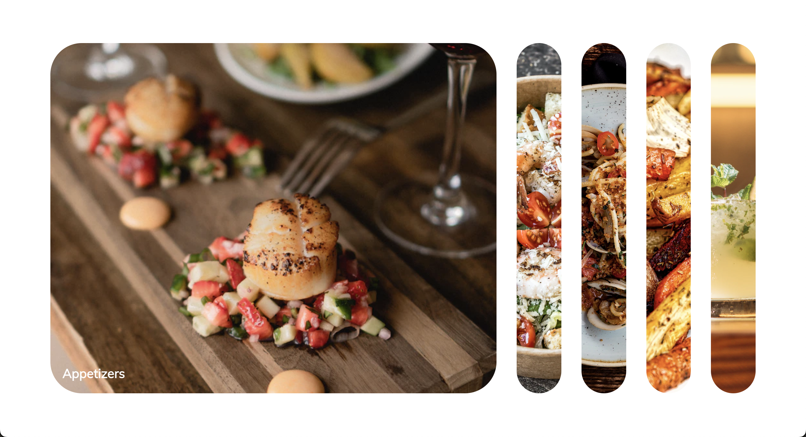

# Expanding Cards

This is project 1 of 50 for Brad Traversy's course [50 Projects in 50 Days](https://50projects50days.com/). For my implementation, I decided to mimic sections of a restaurant's menu that could appear on their website.

All of the projects are built with HTML, CSS and JavaScript.

## Screenshot and Live Demo

[Click here to view the live demo](https://sianidan.github.io/Expanding-Cards/)